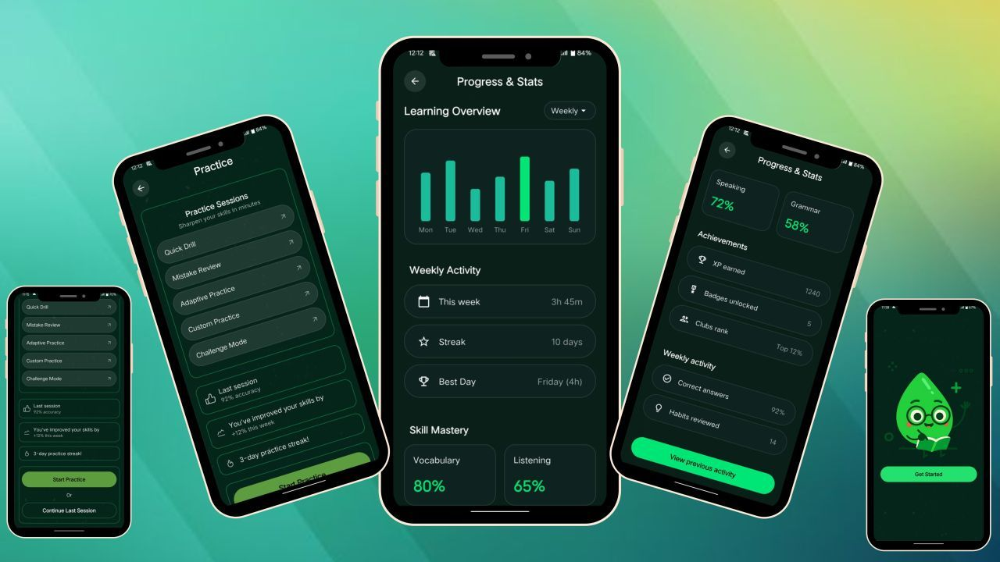
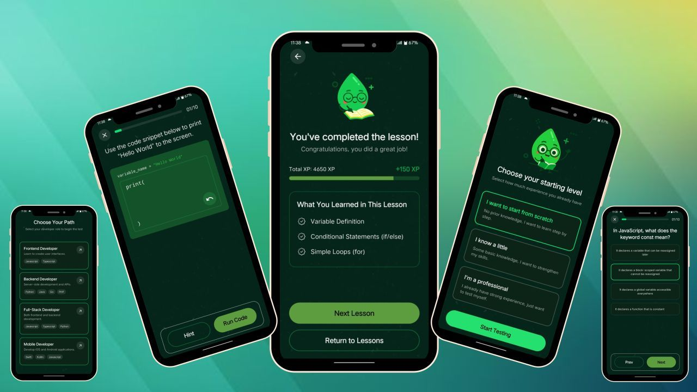
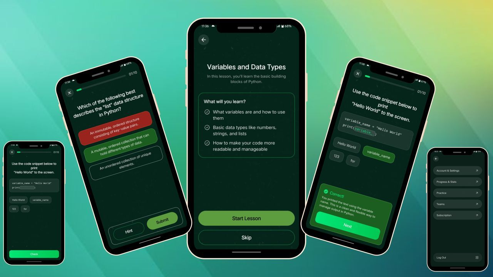
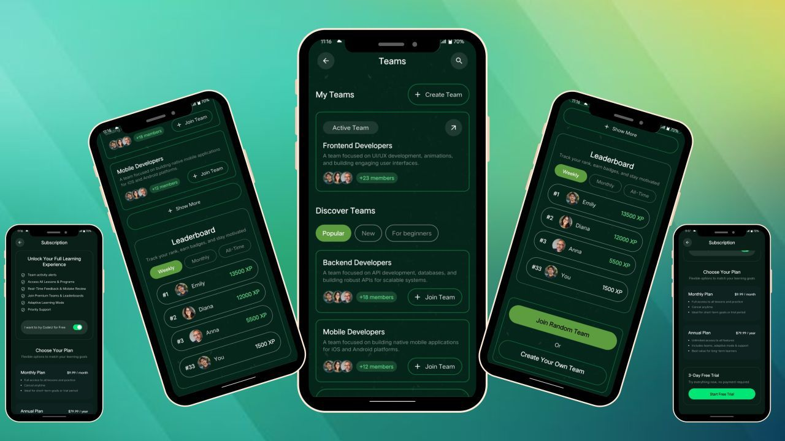
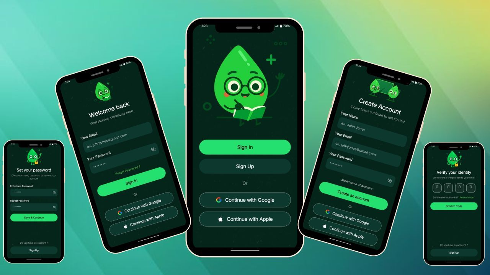

# 💻 CodeU — Coding Learning & Practice Platform

## 📱 About The Project

CodeU is a modern coding learning & practice platform developed using Flutter, designed to help users improve their programming skills through interactive practice modules, progress tracking, team collaboration, and structured learning programs.

The application provides a clean and responsive learning environment where users can practice coding, track achievements, participate in challenges, and monitor their overall learning progress effectively.

Built with scalable architecture and a professional UI/UX approach, CodeU delivers a smooth cross-platform experience for both Android and iOS users.

---

# 🌟 Project Highlights

- 📊 Progress & Statistics Dashboard
- 🧠 Adaptive Practice System
- 🏆 Achievements & Milestones
- 👥 Team Collaboration Features
- 🎯 Coding Challenge Modules
- 📚 Structured Learning Programs
- 💳 Subscription System
- 📱 Responsive Flutter UI

---

# 🔑 Key Features

## 👤 Account & Settings Management

Users can:

- Manage profiles
- Update account settings
- Control personal preferences
- Delete accounts securely

---

## 📊 Progress & Statistics Dashboard

The platform provides detailed analytics including:

- Weekly activity tracking
- Coding time analytics
- Learning progress monitoring
- Achievements & milestone system

---

## 🧠 Practice & Testing Modules

CodeU includes multiple coding practice systems such as:

- Quick Drill
- Mistake Review
- Adaptive Practice
- Custom Practice
- Challenge Mode

These modules help users strengthen coding skills efficiently.

---

## 👥 Team Collaboration System

Users can:

- Create and manage coding teams
- Join categorized groups
- Collaborate with developers

### Team Categories

- Popular
- New
- Beginners

---

## 📚 Programs Module

Structured learning programs available for:

- Frontend Development
- Backend Development
- Data Science
- DevOps
- Cloud Computing

---

## 🎯 Advanced Filters

Users can filter content by:

### Topics

- Frontend
- Backend
- Full Stack

### Levels

- Beginner
- Intermediate
- Advanced

### Formats

- Solo Projects
- Team Projects
- Challenges

---

## 💳 Subscription System

The app includes:

- Monthly plans
- Annual subscriptions
- 3-Day free trial access

---

# 🛠️ Tech Stack

| Technology | Usage |
|------------|-------|
| Flutter | Frontend Development |
| Dart | Programming Language |
| Firebase | Authentication & Backend |
| VS Code | Development Environment |

---

# 🌟 Project Achievement

This project strengthened expertise in building complex, production-ready Flutter applications while maintaining high code quality, scalability, and excellent user experience.

---

# 📱 Application Screenshots

  

---

# 🚀 Future Improvements

- AI Coding Assistant
- Live Coding Sessions
- Real-Time Leaderboards
- Coding Certifications
- Interview Preparation Module

---

# 🤝 Let’s Connect

Open for Flutter development, freelance projects, and remote opportunities.

📩 Feel free to connect through GitHub or LinkedIn.

---

# ⭐ Support

If you like this project, don't forget to star the repository ⭐
